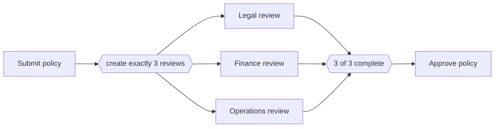

---
title: "Multiple Instances with a Priori Design-Time Knowledge"
category: "[[Control-Flow/_Control-Flow Patterns|Control-Flow Patterns]]"
group: "Multiple Instance Patterns"
---
**Intent:** Create a fixed number of activity instances known when the process model is designed, then synchronize them.

**Use when:** The cardinality is a stable part of the process definition, such as exactly three required reviews.

**Modeling notes:** Because the number is fixed, the join can be a simple count over known instances. Avoid this pattern when the count depends on case data.

Source: [workflowpatterns.com](http://workflowpatterns.com/patterns/control/multiple_instance/wcp13.php).
