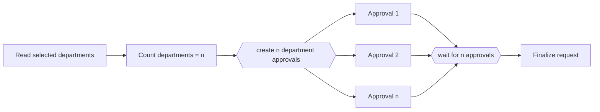

---
title: "Multiple Instances with a Priori Run-Time Knowledge"
category: "[[Control-Flow/_Control-Flow Patterns|Control-Flow Patterns]]"
group: "Multiple Instance Patterns"
---
**Intent:** Create a runtime-determined number of activity instances, known before the first instance starts, then synchronize them.

**Use when:** Case data determines the instance count up front, such as one approval per selected department.

**Modeling notes:** Capture the runtime count before spawning instances and use that count as the synchronization target. Later additions require a different pattern.

Source: [workflowpatterns.com](http://workflowpatterns.com/patterns/control/multiple_instance/wcp14.php).
