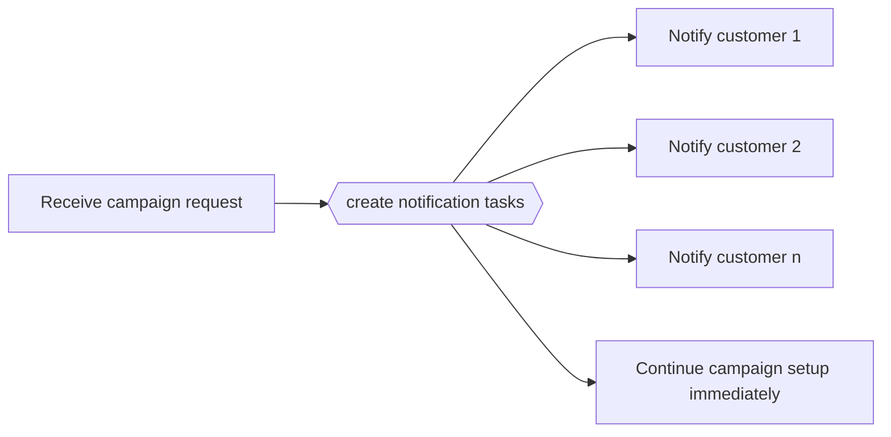

---
title: "Multiple Instances without Synchronization"
category: "[[Control-Flow/_Control-Flow Patterns|Control-Flow Patterns]]"
group: "Multiple Instance Patterns"
---
**Intent:** Create several instances of one activity and let the workflow continue without waiting for them.

**Use when:** The instances are fire-and-forget from the perspective of the current case path.

**Modeling notes:** Do not imply downstream dependence on the instance results. If later work needs all or some completions, use one of the synchronized multiple-instance patterns instead.

Source: [workflowpatterns.com](http://workflowpatterns.com/patterns/control/multiple_instance/wcp12.php).
