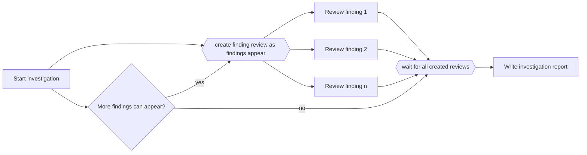

---
title: "Multiple Instances without a Priori Run-Time Knowledge"
category: "[[Control-Flow/_Control-Flow Patterns|Control-Flow Patterns]]"
group: "Multiple Instance Patterns"
---
**Intent:** Allow new instances to be created while existing instances are already running, then synchronize when creation has stopped and all instances finish.

**Use when:** The required work items are discovered progressively during execution.

**Modeling notes:** The model needs both a completion condition for instance creation and a join condition for all created instances. Without a clear close rule, the join can wait forever.

Source: [workflowpatterns.com](http://workflowpatterns.com/patterns/control/multiple_instance/wcp15.php).
