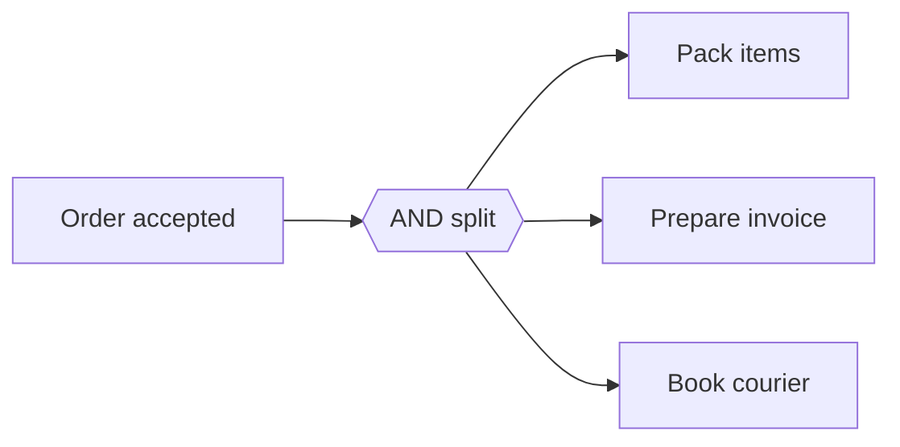

---
title: "Parallel Split"
category: "[[Control-Flow/_Control-Flow Patterns|Control-Flow Patterns]]"
group: "Basic Control Flow Patterns"
---
**Intent:** Enable several branches from one point so they can proceed independently.

**Use when:** A case needs multiple pieces of work to start after the same precondition, and their relative completion order is not important at the split.

**Modeling notes:** The split only creates concurrency; it does not say how or whether the branches later rejoin. Pair it with the correct join pattern when downstream work depends on multiple branch outcomes.

Source: [workflowpatterns.com](http://workflowpatterns.com/patterns/control/basic/wcp2.php).
