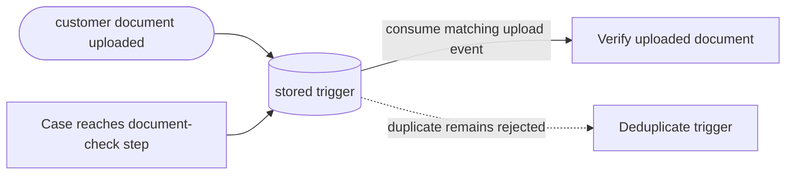

---
title: "Persistent Trigger"
category: "[[Control-Flow/_Control-Flow Patterns|Control-Flow Patterns]]"
group: "Trigger Patterns"
---
**Intent:** Start or resume work from an external signal that is retained until the workflow consumes it.

**Use when:** The signal can arrive before the workflow is ready, and the workflow should still react later.

**Modeling notes:** Model the trigger store or correlation key. Persistent triggers reduce missed events but require rules for duplicate, stale, or already-consumed signals.

Source: [workflowpatterns.com](http://workflowpatterns.com/patterns/control/new/wcp24.php).
