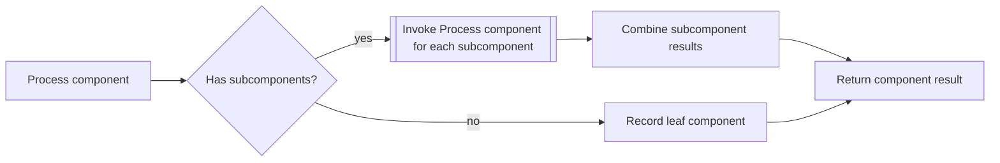

---
title: "Recursion"
category: "[[Control-Flow/_Control-Flow Patterns|Control-Flow Patterns]]"
group: "Iteration Patterns"
---
**Intent:** Invoke the same workflow or subprocess definition from within itself.

**Use when:** Work has a naturally recursive structure, such as nested approvals, bill-of-materials traversal, or hierarchical decomposition.

**Modeling notes:** Define the base case that stops recursion and the data passed to each invocation. Without explicit depth or termination rules, recursive workflows can create unbounded instances.

Source: [workflowpatterns.com](http://workflowpatterns.com/patterns/control/new/wcp22.php).
