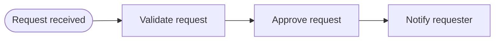

---
title: "Sequence"
category: "[[Control-Flow/_Control-Flow Patterns|Control-Flow Patterns]]"
group: "Basic Control Flow Patterns"
---
**Intent:** Make one activity depend unconditionally on the completion of another.

**Use when:** The second activity must not be offered, started, or completed until the first activity has finished successfully.

**Modeling notes:** Sequence is the default building block for dependency order, not a statement about who performs the work or how long it takes. Avoid hiding decisions in sequence arrows; if the next activity is conditional, model the decision explicitly.

Source: [workflowpatterns.com](http://workflowpatterns.com/patterns/control/basic/wcp1.php).
