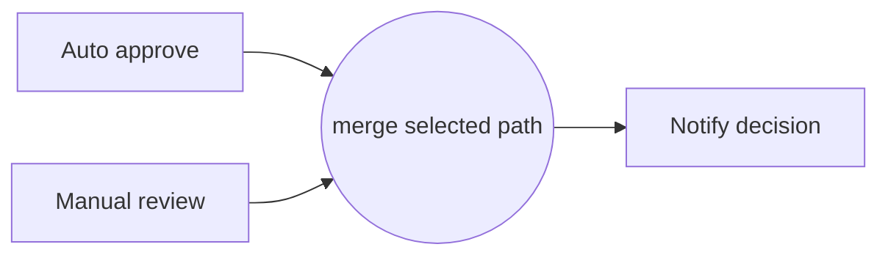

---
title: "Simple Merge"
category: "[[Control-Flow/_Control-Flow Patterns|Control-Flow Patterns]]"
group: "Basic Control Flow Patterns"
---
**Intent:** Bring mutually exclusive alternatives back to one continuation point without synchronization.

**Use when:** Only one incoming branch can be active for the case, typically because an earlier exclusive choice selected one alternative.

**Modeling notes:** A simple merge must not be used after parallel or multi-choice routing. If more than one branch can arrive, the continuation may fire more than once or too early.

Source: [workflowpatterns.com](http://workflowpatterns.com/patterns/control/basic/wcp5.php).
