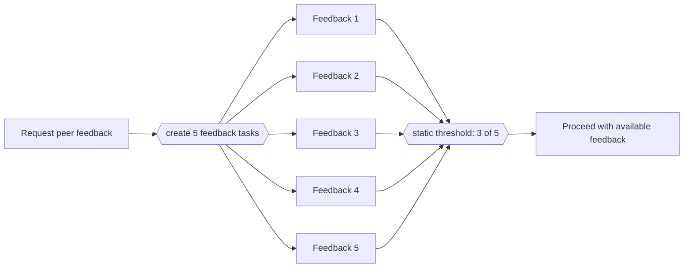

---
title: "Static Partial Join for Multiple Instances"
category: "[[Control-Flow/_Control-Flow Patterns|Control-Flow Patterns]]"
group: "Multiple Instance Patterns"
---
**Intent:** Continue after a fixed threshold of multiple activity instances completes.

**Use when:** The total instance count and required completion count are known before the instances start.

**Modeling notes:** The threshold should be modeled separately from the total count, such as 3 of 5. Remaining instances may still complete, but they must not trigger the continuation again.

Source: [workflowpatterns.com](http://workflowpatterns.com/patterns/control/new/wcp34.php).
