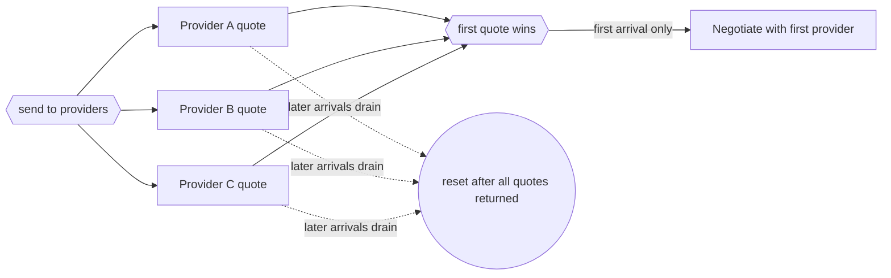

---
title: "Structured Discriminator"
category: "[[Control-Flow/_Control-Flow Patterns|Control-Flow Patterns]]"
group: "Advanced Branching and Synchronization Patterns"
---
**Intent:** Continue after the first branch in a structured parallel block completes, then reset after all remaining branches have completed.

**Use when:** The earliest result is enough to start the continuation, but the workflow must still drain the other branches before another structured instance can reuse the discriminator.

**Modeling notes:** The first arrival enables the next activity once. Later arrivals from the same block are ignored for continuation, but they are still required for reset.

Source: [workflowpatterns.com](http://workflowpatterns.com/patterns/control/advanced_branching/wcp9.php).
