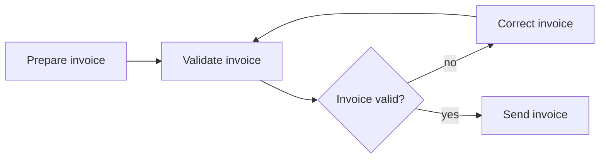

---
title: "Structured Loop"
category: "[[Control-Flow/_Control-Flow Patterns|Control-Flow Patterns]]"
group: "Iteration Patterns"
---
**Intent:** Repeat a well-defined block while or until a loop condition holds.

**Use when:** Repetition has a single entry, single exit, and a clear test condition.

**Modeling notes:** Prefer structured loops when possible because they make termination and synchronization easier to verify. State whether the condition is tested before or after the repeated activity.

Source: [workflowpatterns.com](http://workflowpatterns.com/patterns/control/new/wcp21.php).
