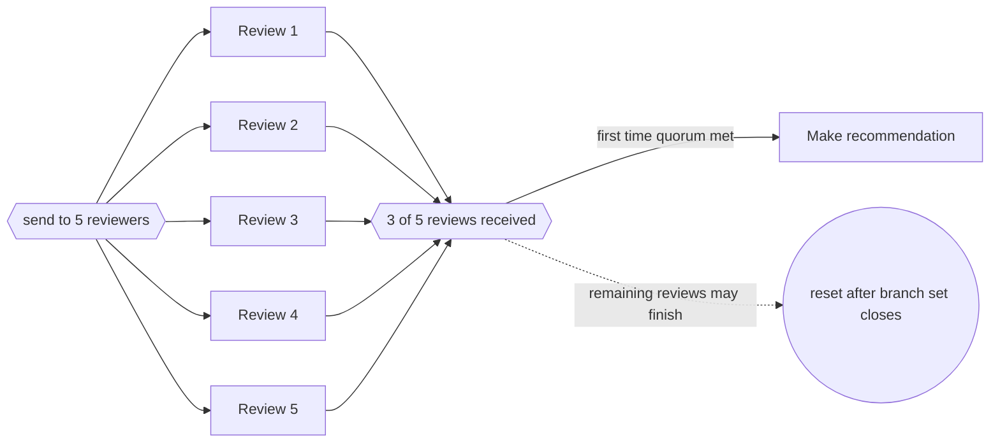

---
title: "Structured Partial Join"
category: "[[Control-Flow/_Control-Flow Patterns|Control-Flow Patterns]]"
group: "Advanced Branching and Synchronization Patterns"
---
**Intent:** Continue when a fixed number of branches in a structured block have completed, then ignore the remaining completions for continuation while allowing reset.

**Use when:** A quorum of results is sufficient, but the rest of the structured branch set may still finish normally.

**Modeling notes:** The threshold is lower than the number of active branches. The model must state both the required count and what happens to late completions.

Source: [workflowpatterns.com](http://workflowpatterns.com/patterns/control/new/wcp30.php).
