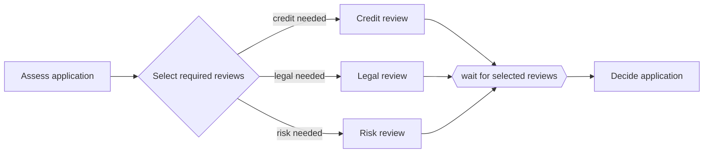

---
title: "Structured Synchronizing Merge"
category: "[[Control-Flow/_Control-Flow Patterns|Control-Flow Patterns]]"
group: "Advanced Branching and Synchronization Patterns"
---
**Intent:** Merge branches from a structured multi-choice by waiting only for the branches selected for this case.

**Use when:** Optional branches are opened by a matching structured split, and the process must continue once all selected branches have arrived.

**Modeling notes:** The split and merge form a single-entry, single-exit block, so the merge can determine the expected active branches from the corresponding split. This is the safest synchronizing merge variant to model.

Source: [workflowpatterns.com](http://workflowpatterns.com/patterns/control/advanced_branching/wcp7.php).
