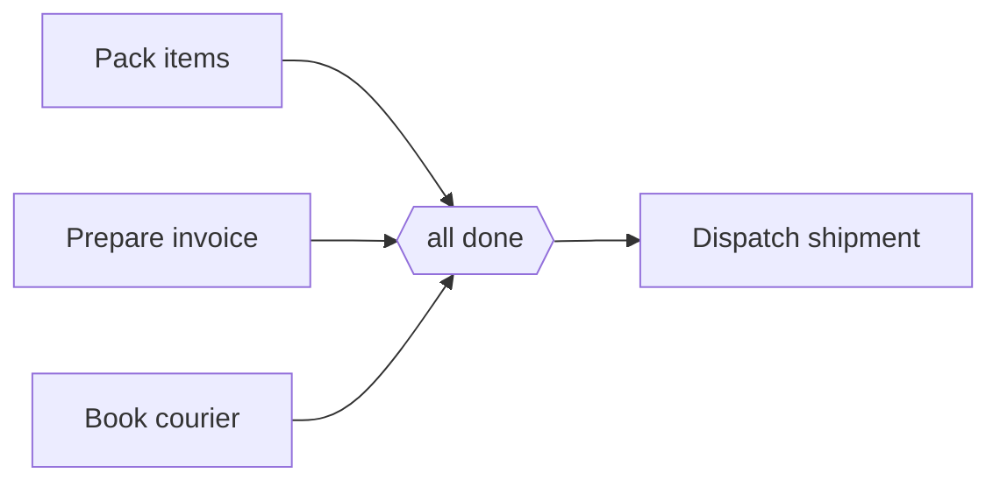

---
title: "Synchronization"
category: "[[Control-Flow/_Control-Flow Patterns|Control-Flow Patterns]]"
group: "Basic Control Flow Patterns"
---
**Intent:** Wait until every active branch from a parallel split has completed before continuing.

**Use when:** The next activity needs all required parallel results and should run exactly once for the case.

**Modeling notes:** Use this for a fixed set of mandatory branches. If some incoming branches may not have been activated, use a synchronizing merge instead of a plain AND-join.

Source: [workflowpatterns.com](http://workflowpatterns.com/patterns/control/basic/wcp3.php).
