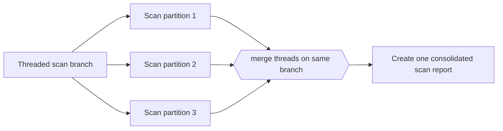

---
title: "Thread Merge"
category: "[[Control-Flow/_Control-Flow Patterns|Control-Flow Patterns]]"
group: "Advanced Branching and Synchronization Patterns"
---
**Intent:** Collapse multiple threads of control on one branch into a single thread.

**Use when:** A branch has produced several concurrent execution threads and the model needs to coalesce them before continuing.

**Modeling notes:** This is about control threads, not data aggregation alone. Clarify whether results are combined, selected, or merely allowed to finish before the single continuation.

Source: [workflowpatterns.com](http://workflowpatterns.com/patterns/control/new/wcp41.php).
