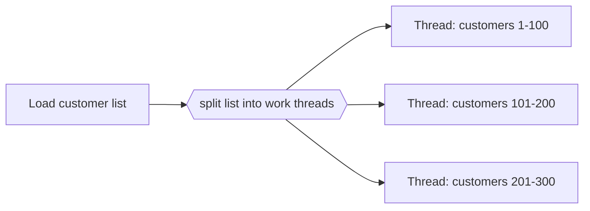

---
title: "Thread Split"
category: "[[Control-Flow/_Control-Flow Patterns|Control-Flow Patterns]]"
group: "Advanced Branching and Synchronization Patterns"
---
**Intent:** Split one thread of control into multiple threads on the same branch, often for a partitioned workload.

**Use when:** A single activity or branch needs to fan out internally without modeling each target as a different business route.

**Modeling notes:** Thread split differs from parallel split by producing multiple execution threads for one logical branch. It is useful for item partitions, batched work, or parallelized subwork under one activity definition.

Source: [workflowpatterns.com](http://workflowpatterns.com/patterns/control/new/wcp42.php).
