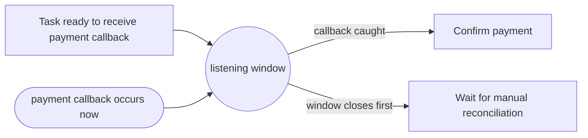

---
title: "Transient Trigger"
category: "[[Control-Flow/_Control-Flow Patterns|Control-Flow Patterns]]"
group: "Trigger Patterns"
---
**Intent:** Start or resume work only if an external signal is observed while the activity is ready to accept it.

**Use when:** The signal is not stored for later consumption, such as a live event, timeout tick, or immediate callback.

**Modeling notes:** If the workflow is not listening when the trigger occurs, the trigger is lost. Model the listening state and timeout behavior explicitly.

Source: [workflowpatterns.com](http://workflowpatterns.com/patterns/control/new/wcp23.php).
