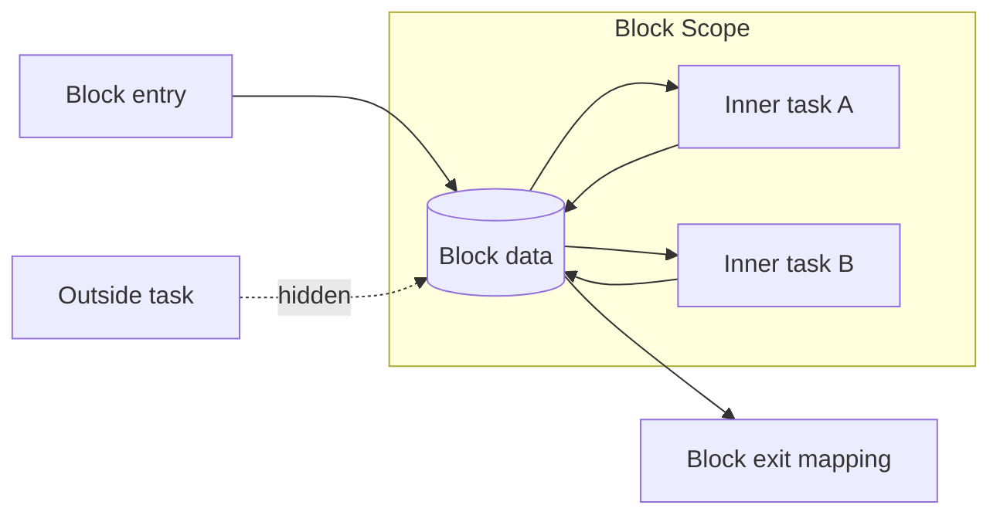

---
title: "Block Data"
category: "[[Data/_Data Patterns|Data Patterns]]"
group: "Visibility Patterns"
---
Intent: Represent data that is shared by tasks inside one block and hidden from tasks outside that block.

Use when: A structured block, subprocess region, or compound activity needs shared state for its internal tasks without adding that state to the whole case.

Modeling notes: Treat the block as a visibility boundary. Internal tasks may read and update the block data, while entry and exit mappings decide what crosses the boundary.

Source: [workflowpatterns.com](http://workflowpatterns.com/patterns/data/visibility/wdp2.php).
