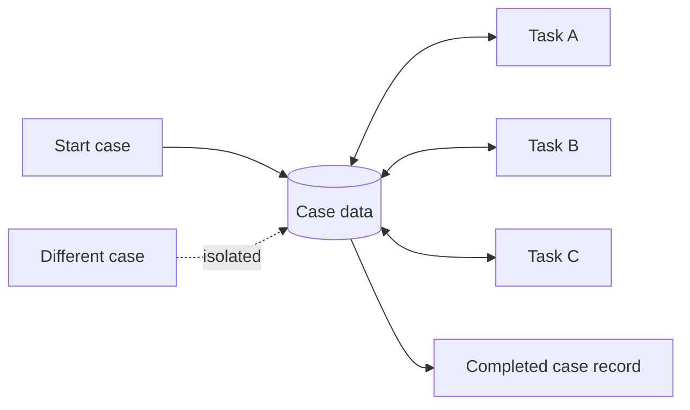

---
title: "Case Data"
category: "[[Data/_Data Patterns|Data Patterns]]"
group: "Visibility Patterns"
---
Intent: Represent data available to all tasks that participate in one workflow case or process instance.

Use when: A process instance has business state, customer data, decisions, documents, or status values that several tasks in the same case must share.

Modeling notes: Case data is the default shared memory of an instance, so keep it deliberate. Avoid placing temporary task details in case data, and define update ownership for values that multiple tasks can modify.

Source: [workflowpatterns.com](http://workflowpatterns.com/patterns/data/visibility/wdp5.php).
