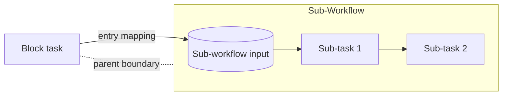

---
title: "Data Interaction - Block Task to Sub-Workflow Decomposition"
category: "[[Data/_Data Patterns|Data Patterns]]"
group: "Internal Interaction Patterns"
---
Intent: Pass data from a block task wrapper into the sub-workflow that implements it.

Use when: A high-level block task is decomposed into a detailed sub-workflow and the decomposition needs input values from the parent block task.

Modeling notes: Model the block task as the caller and the sub-workflow as the callee. Use entry mappings to say which parent values become sub-workflow input data.

Source: [workflowpatterns.com](http://workflowpatterns.com/patterns/data/internal/wdp10.php).
