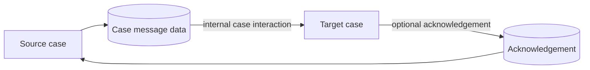

---
title: "Data Interaction - Case to Case"
category: "[[Data/_Data Patterns|Data Patterns]]"
group: "Internal Interaction Patterns"
---
Intent: Transfer data between two workflow cases under the same workflow environment.

Use when: One case must notify, update, synchronize with, or provide context to another related case.

Modeling notes: Identify both case identities and whether the interaction is one-way, request-reply, or shared-folder mediated. Avoid silent cross-case reads because they make case isolation unclear.

Source: [workflowpatterns.com](http://workflowpatterns.com/patterns/data/internal/wdp14.php).
