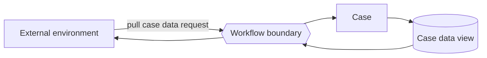

---
title: "Data Interaction - Case to Environment - Pull-Oriented"
category: "[[Data/_Data Patterns|Data Patterns]]"
group: "External Interaction Patterns"
---
Intent: Allow the external environment to request data from a case.

Use when: A portal, external regulator, partner system, or reporting service queries a case for status or case data.

Modeling notes: The environment initiates the read. Model authorization, query scope, privacy rules, and whether the case returns current state or a derived view.

Source: [workflowpatterns.com](http://workflowpatterns.com/patterns/data/external/wdp22.php).
