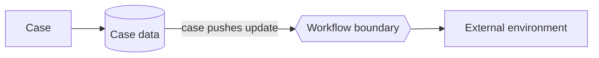

---
title: "Data Interaction - Case to Environment - Push-Oriented"
category: "[[Data/_Data Patterns|Data Patterns]]"
group: "External Interaction Patterns"
---
Intent: Let a case actively send case-level data to the external environment.

Use when: A process instance must publish its status, register a case record, send a dossier update, or notify an outside system independently of a single task's local data.

Modeling notes: The case is the source, so the pushed data should be modeled as case data. Decide whether the push is triggered by a task, state change, milestone, or explicit case operation.

Source: [workflowpatterns.com](http://workflowpatterns.com/patterns/data/external/wdp19.php).
