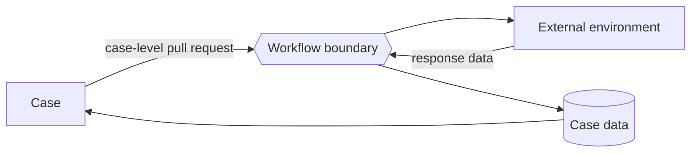

---
title: "Data Interaction - Environment to Case - Pull-Oriented"
category: "[[Data/_Data Patterns|Data Patterns]]"
group: "External Interaction Patterns"
---
Intent: Let a case actively request data from the external environment.

Use when: A case needs external facts, reference values, or records to update case-level state rather than one task-local value.

Modeling notes: The case controls the request. Model where the response lands in case data and how later tasks know the external refresh has occurred.

Source: [workflowpatterns.com](http://workflowpatterns.com/patterns/data/external/wdp20.php).
