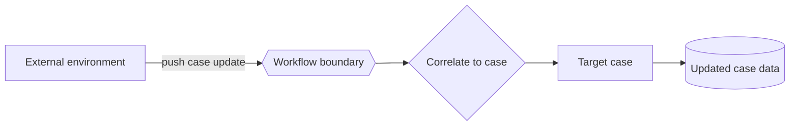

---
title: "Data Interaction - Environment to Case - Push-Oriented"
category: "[[Data/_Data Patterns|Data Patterns]]"
group: "External Interaction Patterns"
---
Intent: Let the external environment actively send data into a workflow case.

Use when: External submissions, events, status messages, uploads, or partner updates must update an existing case.

Modeling notes: Correlation is central. The model should show how the incoming data identifies the target case and whether it creates, updates, or appends to case data.

Source: [workflowpatterns.com](http://workflowpatterns.com/patterns/data/external/wdp21.php).
