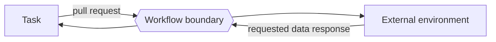

---
title: "Data Interaction - Environment to Task - Pull-Oriented"
category: "[[Data/_Data Patterns|Data Patterns]]"
group: "External Interaction Patterns"
---
Intent: Let a task actively request data from the external environment.

Use when: A task needs current external information, such as a price, identity record, inventory value, or partner status, at execution time.

Modeling notes: The task controls when the read occurs. Model timeout behavior, stale-data tolerance, credentials, and whether the retrieved data is copied into task or case data.

Source: [workflowpatterns.com](http://workflowpatterns.com/patterns/data/external/wdp16.php).
