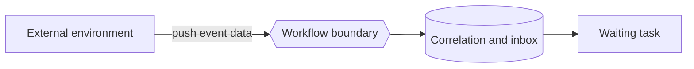

---
title: "Data Interaction - Environment to Task - Push-Oriented"
category: "[[Data/_Data Patterns|Data Patterns]]"
group: "External Interaction Patterns"
---
Intent: Let the external environment actively send data to a task.

Use when: A task waits for an incoming event, callback, submitted form, message, sensor value, or partner response.

Modeling notes: The environment initiates the data movement. Model correlation so the incoming data reaches the correct waiting task instance.

Source: [workflowpatterns.com](http://workflowpatterns.com/patterns/data/external/wdp17.php).
