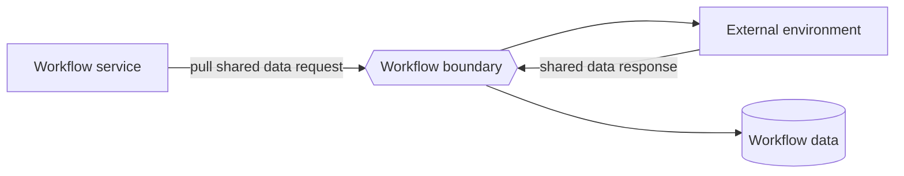

---
title: "Data Interaction - Environment to Workflow - Pull-Oriented"
category: "[[Data/_Data Patterns|Data Patterns]]"
group: "External Interaction Patterns"
---
Intent: Let the workflow actively request external data at workflow scope.

Use when: The workflow definition or engine needs shared external configuration, calendars, policy tables, or global reference data.

Modeling notes: The workflow initiates the pull and stores or uses the response at workflow level. Model refresh cadence and versioning because many cases may consume the result.

Source: [workflowpatterns.com](http://workflowpatterns.com/patterns/data/external/wdp24.php).
