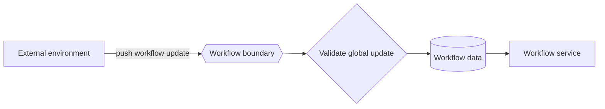

---
title: "Data Interaction - Environment to Workflow - Push-Oriented"
category: "[[Data/_Data Patterns|Data Patterns]]"
group: "External Interaction Patterns"
---
Intent: Let the external environment actively send data to the workflow definition or engine.

Use when: A system-wide event, configuration update, calendar change, deployment signal, or global notification must update workflow-level behavior.

Modeling notes: Because the push targets workflow scope, model how the new data affects active and future cases. Include validation and version transition rules where the external update changes behavior.

Source: [workflowpatterns.com](http://workflowpatterns.com/patterns/data/external/wdp25.php).
