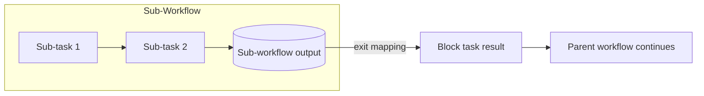

---
title: "Data Interaction - Sub-Workflow Decomposition to Block Task"
category: "[[Data/_Data Patterns|Data Patterns]]"
group: "Internal Interaction Patterns"
---
Intent: Return data produced by a decomposed sub-workflow to the block task that invoked it.

Use when: The parent block task must expose a sub-workflow result, completion status, or calculated output to the rest of the parent workflow.

Modeling notes: Use exit mappings. Keep internal sub-workflow data private unless it is intentionally mapped back to the block task output.

Source: [workflowpatterns.com](http://workflowpatterns.com/patterns/data/internal/wdp11.php).
