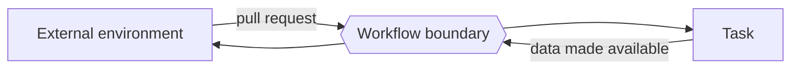

---
title: "Data Interaction - Task to Environment - Pull-Oriented"
category: "[[Data/_Data Patterns|Data Patterns]]"
group: "External Interaction Patterns"
---
Intent: Allow the external environment to request data from a task.

Use when: A task exposes data that an external actor, service, or user interface retrieves when needed.

Modeling notes: The environment initiates the pull. Model whether the task can respond while active only, after completion, or through a retained task result.

Source: [workflowpatterns.com](http://workflowpatterns.com/patterns/data/external/wdp18.php).
