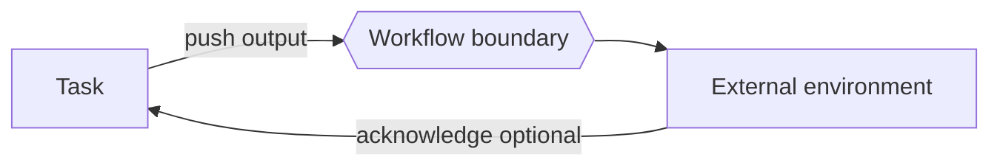

---
title: "Data Interaction - Task to Environment - Push-Oriented"
category: "[[Data/_Data Patterns|Data Patterns]]"
group: "External Interaction Patterns"
---
Intent: Let a task actively send data to an external environment.

Use when: A task must publish a result, call an external service, write to an external database, send a message, or notify a partner system.

Modeling notes: The task initiates the interaction. Model delivery guarantees, error handling, retries, and whether task completion waits for external acknowledgement.

Source: [workflowpatterns.com](http://workflowpatterns.com/patterns/data/external/wdp15.php).
