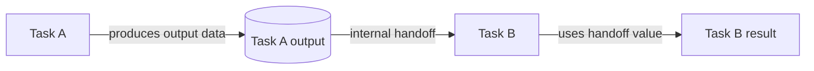

---
title: "Data Interaction - Task to Task"
category: "[[Data/_Data Patterns|Data Patterns]]"
group: "Internal Interaction Patterns"
---
Intent: Pass data produced or held by one task directly to a following task.

Use when: The target task requires a result, selection, document, or calculated value from a specific predecessor rather than from a broad case data store.

Modeling notes: Make the dependency explicit. If the second task only needs a stable snapshot, combine this interaction with transfer by value; if it must observe live shared state, model a reference or case-data interaction instead.

Source: [workflowpatterns.com](http://workflowpatterns.com/patterns/data/internal/wdp9.php).
