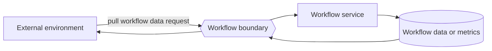

---
title: "Data Interaction - Workflow to Environment - Pull-Oriented"
category: "[[Data/_Data Patterns|Data Patterns]]"
group: "External Interaction Patterns"
---
Intent: Allow the external environment to request workflow-level data.

Use when: Monitoring tools, administrators, partner systems, or discovery clients query workflow definitions, shared state, service capability, or aggregate metrics.

Modeling notes: The environment initiates the read. Keep this distinct from case queries: the response describes workflow-level data, not one process instance.

Source: [workflowpatterns.com](http://workflowpatterns.com/patterns/data/external/wdp26.php).
