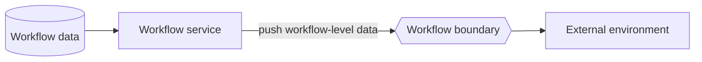

---
title: "Data Interaction - Workflow to Environment - Push-Oriented"
category: "[[Data/_Data Patterns|Data Patterns]]"
group: "External Interaction Patterns"
---
Intent: Let the workflow definition or engine actively send workflow-level data to the external environment.

Use when: The process model, engine, or workflow service publishes configuration, metrics, definitions, availability, or shared workflow state.

Modeling notes: This is not a single case or task update. Model it at workflow scope and make clear whether active cases are affected by the same operation.

Source: [workflowpatterns.com](http://workflowpatterns.com/patterns/data/external/wdp23.php).
