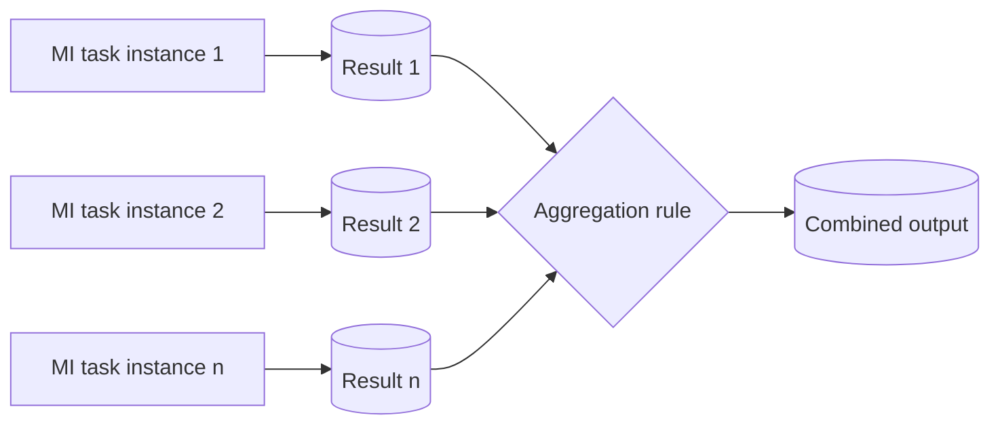

---
title: "Data Interaction - from Multiple Instance Task"
category: "[[Data/_Data Patterns|Data Patterns]]"
group: "Internal Interaction Patterns"
---
Intent: Collect data produced by individual instances of a multiple-instance task.

Use when: Parallel or repeated task instances each produce partial results that must be merged, selected, counted, or otherwise aggregated.

Modeling notes: Define the aggregation rule and completion threshold. The model should show whether every instance contributes, only the first successful instance contributes, or results are combined after a quorum.

Source: [workflowpatterns.com](http://workflowpatterns.com/patterns/data/internal/wdp13.php).
