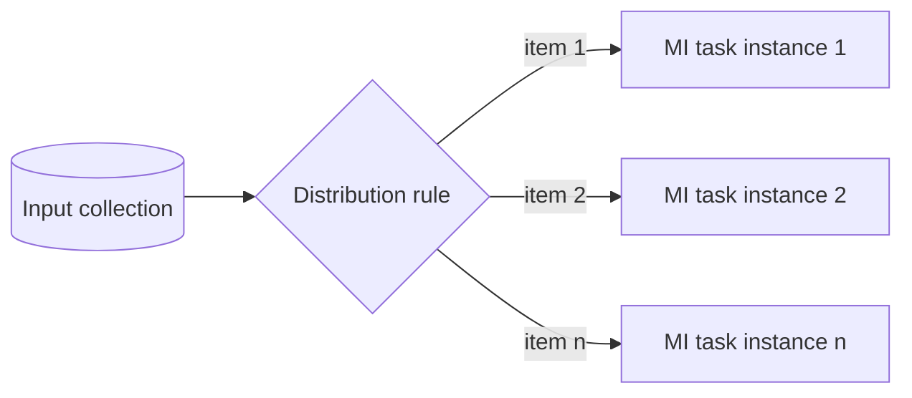

---
title: "Data Interaction - to Multiple Instance Task"
category: "[[Data/_Data Patterns|Data Patterns]]"
group: "Internal Interaction Patterns"
---
Intent: Distribute input data to the individual instances of a multiple-instance task.

Use when: A collection, batch, participant list, or set of work items must be split so each task instance receives its assigned data.

Modeling notes: Specify the distribution rule: one item per instance, full collection per instance, partitioned chunks, or keyed assignment. This prevents ambiguity about what each instance can see.

Source: [workflowpatterns.com](http://workflowpatterns.com/patterns/data/internal/wdp12.php).
