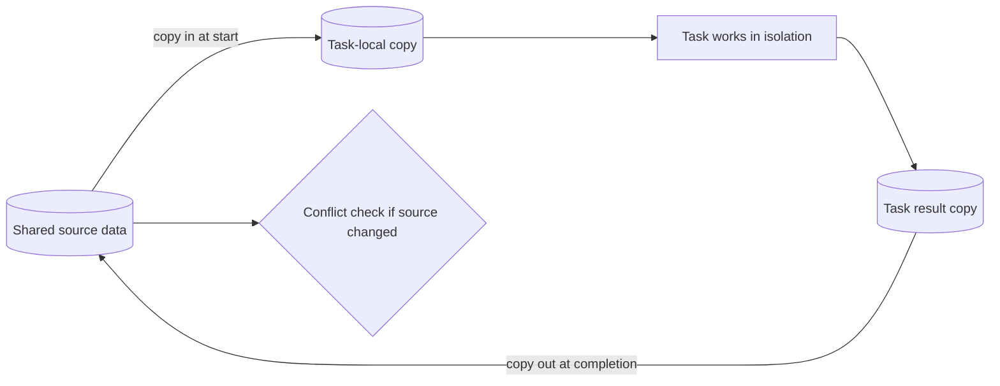

---
title: "Data Transfer - Copy In-Copy Out"
category: "[[Data/_Data Patterns|Data Patterns]]"
group: "Transfer and Transformation Patterns"
---
Intent: Copy source data into a task at start and copy selected task results back out at completion.

Use when: A task needs isolation during execution but the workflow must update shared data when the task completes.

Modeling notes: This pattern has two separate copy moments. Model conflict handling for cases where the original source changes between copy-in and copy-out.

Source: [workflowpatterns.com](http://workflowpatterns.com/patterns/data/mechanisms/wdp29.php).
