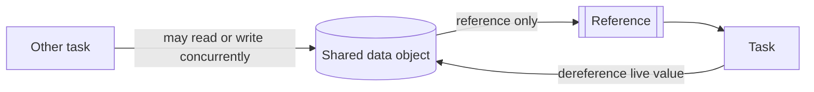

---
title: "Data Transfer by Reference - Unlocked"
category: "[[Data/_Data Patterns|Data Patterns]]"
group: "Transfer and Transformation Patterns"
---
Intent: Give a task a reference to source data without locking the referenced data.

Use when: The task should access live data and concurrent readers or writers are acceptable.

Modeling notes: This creates live coupling. Model concurrency risks, stale reads, and whether the task expects repeat reads to return the same value.

Source: [workflowpatterns.com](http://workflowpatterns.com/patterns/data/mechanisms/wdp30.php).
