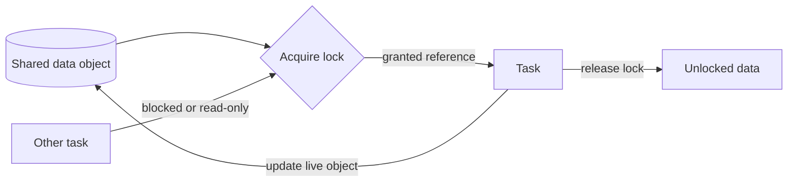

---
title: "Data Transfer by Reference - With Lock"
category: "[[Data/_Data Patterns|Data Patterns]]"
group: "Transfer and Transformation Patterns"
---
Intent: Give a task a reference to source data while locking that data against conflicting access.

Use when: The task must work with live shared data but requires exclusive or controlled access while it runs.

Modeling notes: Define lock scope, lock mode, timeout, and release point. A locked reference can prevent lost updates, but it can also block other work.

Source: [workflowpatterns.com](http://workflowpatterns.com/patterns/data/mechanisms/wdp31.php).
