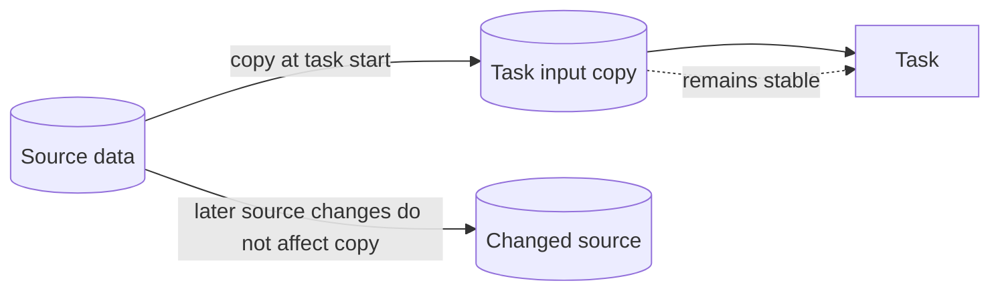

---
title: "Data Transfer by Value - Incoming"
category: "[[Data/_Data Patterns|Data Patterns]]"
group: "Transfer and Transformation Patterns"
---
Intent: Give a task an incoming copy of source data.

Use when: The task should work with a stable snapshot and changes to the source after task start must not affect the task.

Modeling notes: Incoming by value breaks live coupling. Model the copy point clearly, and decide what happens if the source value changes while the task is still running.

Source: [workflowpatterns.com](http://workflowpatterns.com/patterns/data/mechanisms/wdp27.php).
