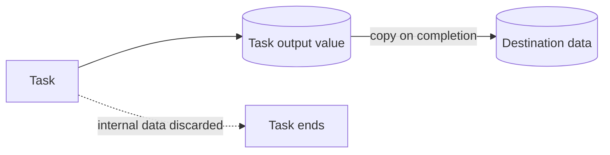

---
title: "Data Transfer by Value - Outgoing"
category: "[[Data/_Data Patterns|Data Patterns]]"
group: "Transfer and Transformation Patterns"
---
Intent: Copy a task's output value into a destination data element.

Use when: The workflow needs the result of a task but should not expose or retain the task's internal data object.

Modeling notes: Model the copy at task completion or at the chosen output event. The destination receives a value, not a pointer back into the task.

Source: [workflowpatterns.com](http://workflowpatterns.com/patterns/data/mechanisms/wdp28.php).
