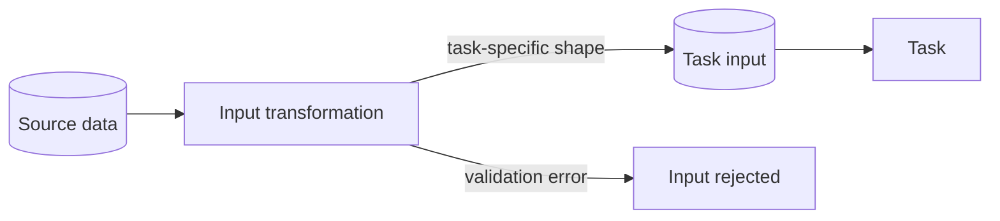

---
title: "Data Transformation - Input"
category: "[[Data/_Data Patterns|Data Patterns]]"
group: "Transfer and Transformation Patterns"
---
Intent: Transform incoming data before it is presented to a task.

Use when: A task requires a different data shape, type, unit, schema, vocabulary, or view than the source provides.

Modeling notes: Place the transform before the activity boundary. Keep source data, transformed input, and task-local data distinct so validation errors can be traced.

Source: [workflowpatterns.com](http://workflowpatterns.com/patterns/data/mechanisms/wdp32.php).
