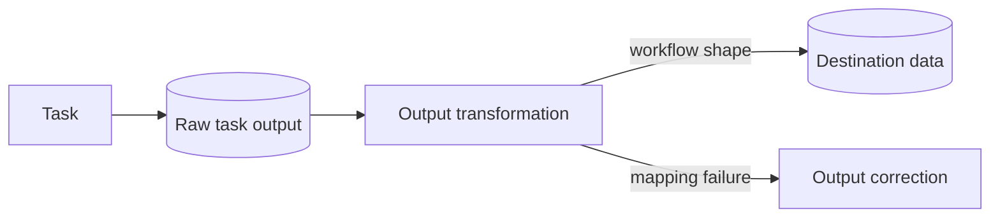

---
title: "Data Transformation - Output"
category: "[[Data/_Data Patterns|Data Patterns]]"
group: "Transfer and Transformation Patterns"
---
Intent: Transform task output before it is stored, routed, or passed onward.

Use when: A task produces data in an internal, user-interface, or service-specific shape that must be normalized for the workflow or a downstream consumer.

Modeling notes: Place the transform after the activity boundary. Model both successful output mapping and invalid output handling.

Source: [workflowpatterns.com](http://workflowpatterns.com/patterns/data/mechanisms/wdp33.php).
