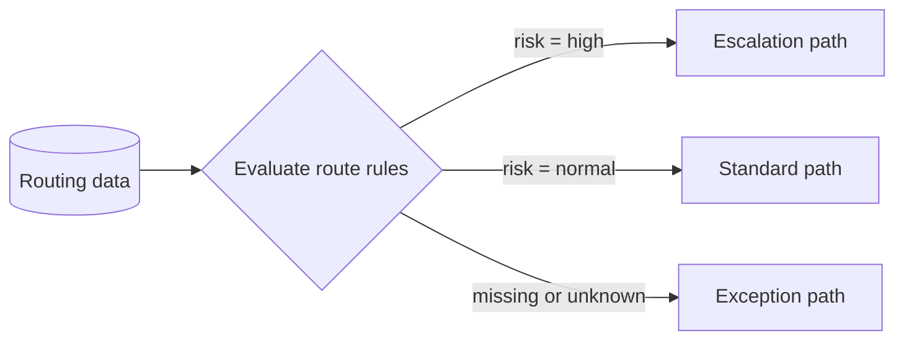

---
title: "Data-based Routing"
category: "[[Data/_Data Patterns|Data Patterns]]"
group: "Data-Driven Routing and Trigger Patterns"
---
Intent: Choose the next workflow path based on data values available at a routing point.

Use when: A process must branch, skip, escalate, select a subprocess, or choose a handler according to case data, task output, workflow data, or external facts.

Modeling notes: Make the data source and decision table visible. Include a default route for missing or unexpected values and keep routing conditions mutually clear.

Source: [workflowpatterns.com](http://workflowpatterns.com/patterns/data/routing/wdp40.php).
