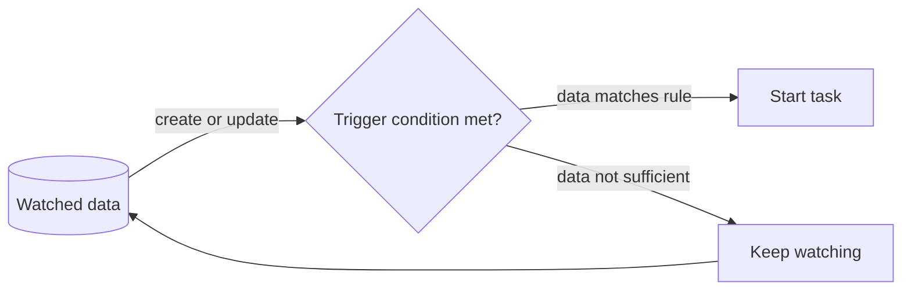

---
title: "Data-based Task Trigger"
category: "[[Data/_Data Patterns|Data Patterns]]"
group: "Data-Driven Routing and Trigger Patterns"
---
Intent: Start a task when workflow data changes or reaches a triggering state.

Use when: A task should be created or started because a data item appears, changes, crosses a threshold, or matches a rule.

Modeling notes: This is triggered by data state, not by a generic event. Model the watched data item, the change rule, and whether historical values matter.

Source: [workflowpatterns.com](http://workflowpatterns.com/patterns/data/routing/wdp39.php).
