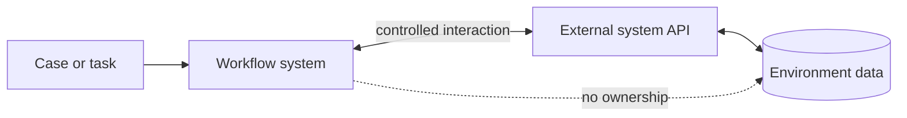

---
title: "Environment Data"
category: "[[Data/_Data Patterns|Data Patterns]]"
group: "Visibility Patterns"
---
Intent: Represent data owned outside the workflow system but used by workflow tasks, cases, or definitions.

Use when: A workflow depends on external databases, services, user directories, devices, partners, message queues, or enterprise systems.

Modeling notes: Treat external data as outside the workflow's direct control. Model availability, latency, security, freshness, and whether the workflow reads, writes, subscribes, or exposes data to the environment.

Source: [workflowpatterns.com](http://workflowpatterns.com/patterns/data/visibility/wdp8.php).
