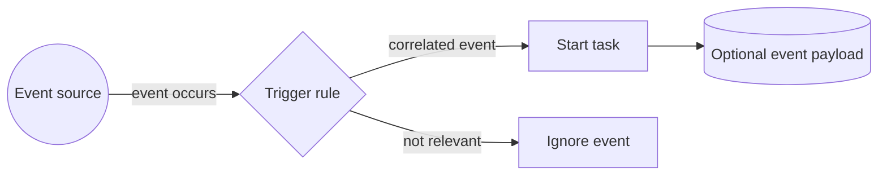

---
title: "Event-based Task Trigger"
category: "[[Data/_Data Patterns|Data Patterns]]"
group: "Data-Driven Routing and Trigger Patterns"
---
Intent: Start a task when a relevant event occurs.

Use when: Work should begin because of a time event, external message, signal, callback, user action, or system event rather than because a data predicate became true.

Modeling notes: Model event source, subscription, correlation, and whether the trigger is consumed once or can fire repeatedly. Keep the event distinct from the data payload it may carry.

Source: [workflowpatterns.com](http://workflowpatterns.com/patterns/data/routing/wdp38.php).
