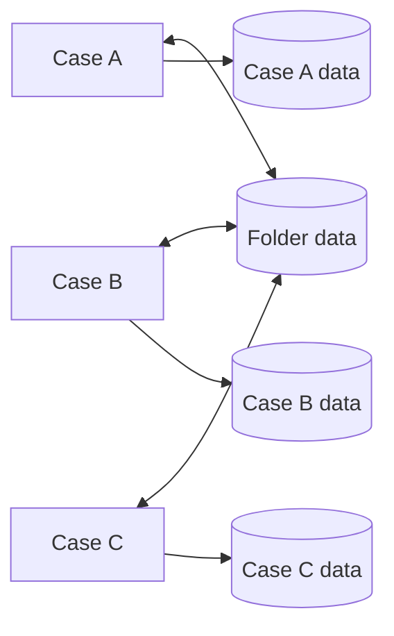

---
title: "Folder Data"
category: "[[Data/_Data Patterns|Data Patterns]]"
group: "Visibility Patterns"
---
Intent: Represent data shared by a group of related cases in a folder or dossier.

Use when: Multiple cases contribute to or depend on a shared matter, claim, customer file, project, or other cross-case container.

Modeling notes: Model the folder as its own data owner. Individual cases should read or update folder data through explicit rules so cross-case effects are visible and auditable.

Source: [workflowpatterns.com](http://workflowpatterns.com/patterns/data/visibility/wdp6.php).
